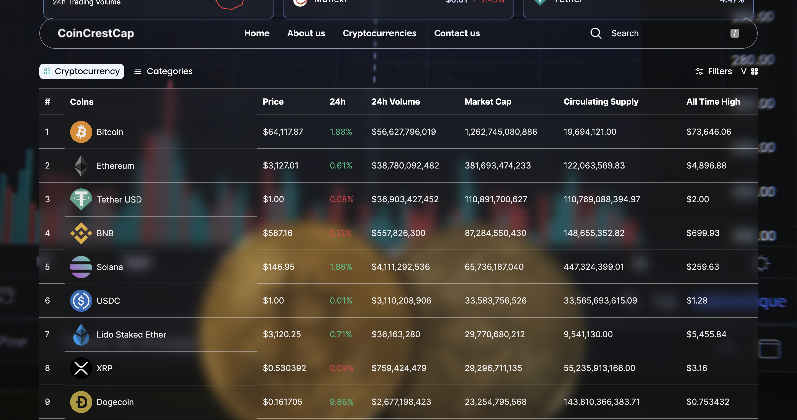

# CRYPTOCRESTCAP ( CryptoCurrency Tracker )
This is a responsive a crypto currency tracker landing page which makes use of multiple APIs to display the most significant information about a coin

## Page Views

## Tools Used
reactJS 
typescript
tailwindCSS
sass

## Prerequisites
 * Node.js installed on your machine
 * npm (Node Package Manager) installed on your machine
 * Git installed on your machine

## Cloning Repo 
 * git clone <repository_url>

## Installing Dependencies
 * npm i / npm install

## Running the App
 * npm run dev

## Get your own Api key
 * Make sure to obtain your own api key from the site coinranking site

## Author 
website - Felix Baah (https://felixbaah.com/)[https://felixbaah.com/]